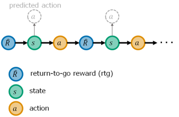

# Decision Transformer Example (Atari Pong)

This example shows you Decision Transformer implementation (and step-by-step explanation in notebook) with introductory Atari Pong game environment.

Unlike [official example](https://github.com/kzl/decision-transformer), this example **is runnable in consumer devices** (mainstream computers with small footprint) - such as, a signle GPU of Tesla T4, NVIDIA RTX, etc - for you to try this code easily.<br>
The notebook also shows you step-by-step explanation behind code.

## Introduction to Decision Transformer

Transformer is today's scalable proven architecture, and this architecture is sometimes used for autoregressive sequential modeling (such as, time-series analysis) by leveraging causally masked Transformers.<br>
Decision Transformer is an offline reinforcement learning algorithm also based on autoregressive sequential modeling, which simply outputs the optimal actions by leveraging a causally masked Transformer.

> Note : Here I assume that you are familiar with Transformer architectures. If you're not familiar with Transformers, please read [this notebook](https://github.com/tsmatz/nlp-tutorials/blob/master/09_transformer.ipynb) before reading and running this example.

In reinforcement learning, the current **state** is given and the agent will then take an appropriate **action** depending on the state. If the action is succeeded, the positive **reward** will be returned to the agent. (See [here](https://github.com/tsmatz/reinforcement-learning-tutorials) for the fundamentals of reinforcement learning.)<br>
In Decision Transformer architecture, the sequence in Transformers consists of multiple tokens - the desired rewards (so called, **return-to-go (rtg) rewards**), states, and actions. (See below note for the return-to-go rewards.)

> Note : The **return-to-go rewards (rtgs)** is the sum of future rewards.<br>
> If the sequence is derived by an expert agent, the first token of rtg will then be high score.<br>
> 

By the autoregressive analysis in Transformers, the next token - especially, the next action - will then be predicted (generated) with causal preceeding tokens.



Given a dataset of offline trajectories, each tokens (i.e, rtgs, states, and actions) will first be embedded into vectors with same dimensions.<br>
The embedded tokens are then fed into [decoder-only Transformer](https://github.com/tsmatz/nlp-tutorials/blob/master/09_transformer.ipynb) (in this example, OpenAI GPT) to generate next tokens.<br>
During the training, only the next actions are used for computing loss and optimization. (The output of states and rtgs are ignored in optimization. The states and rtgs are used only for inputs.)

> Note : Decision Transformer is offline reinforcement learning method.<br>
> See [here](https://tsmatz.wordpress.com/2021/11/11/reinforcement-learning-visual-attention-in-minecraft/) for the online reinforcement learning with Transformers (which implements GTrXL written in "[Stabilizing Transformers for Reinforcement Learning](https://arxiv.org/abs/1910.06764)").

## Prerequisites

Before running, please set up Python and GPU drivers (CUDA).<br>
In my case, I have used Ubuntu Server 20.04 LTS in Microsoft Azure and run the following command.

```
# install tools for compiling
sudo apt-get update
sudo apt install -y gcc
sudo apt-get install -y make

# download and install cuda
wget https://developer.download.nvidia.com/compute/cuda/11.7.1/local_installers/cuda_11.7.1_515.65.01_linux.run
sudo sh cuda_11.7.1_515.65.01_linux.run

# pip setup
sudo apt-get update
sudo apt-get install -y python3-pip
sudo -H pip3 install --upgrade pip
```

This example uses a part of large dataset, [here](https://research.google/resources/datasets/dqn-replay/), for training.<br>
To download this dataset, we need to install ```gsutil```. (Refer [official document](https://cloud.google.com/storage/docs/gsutil_install) for details about installation of ```gsutil```.)

```
echo "deb [signed-by=/usr/share/keyrings/cloud.google.gpg] https://packages.cloud.google.com/apt cloud-sdk main" | sudo tee -a /etc/apt/sources.list.d/google-cloud-sdk.list
curl https://packages.cloud.google.com/apt/doc/apt-key.gpg | sudo apt-key --keyring /usr/share/keyrings/cloud.google.gpg add -
sudo apt-get update && sudo apt-get install google-cloud-cli
```

Install required packages to run this example.

```
pip3 install torch numpy matplotlib opencv-python atari_py
```

In this example, we use an Atari environment in ```atari_py``` package.<br>
Download and import ROMs for running this environment.

```
sudo apt-get install unrar
wget http://www.atarimania.com/roms/Roms.rar
unrar x -r Roms.rar
python3 -m atari_py.import_roms ROMS
```

Install jupyter to run notebook.

```
pip3 install jupyter
```

> Note : In this example, we need to download large dataset from Google, but we only use a part of this dataset.<br>
> Please remove dataset which is not used in this example, or [expand your disk](https://learn.microsoft.com/en-us/azure/virtual-machines/linux/expand-disks) not to exceed disk spaces.

## Run

Start jupyter notebook (see below) and run [dt_atari_pong.ipynb](./dt_atari_pong.ipynb).

```
jupyter notebook
```
